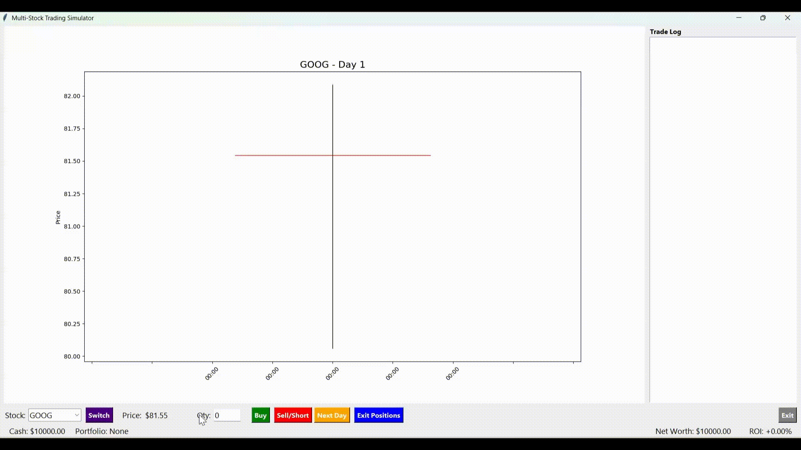

# Multi-Stock Trading Simulator📈

A GUI-based multi-symbol, graphical stock market trading simulator built entirely in Python. It allows users to practice day trading, portfolio management, and short selling against algorithmically generated market data in a risk-free environment.

## Features

- **Realistic Price Action:** Uses Geometric Brownian Motion (GBM) to simulate 120 days of realistic market volatility and generate OHLC (Open, High, Low, Close) data.
- **Dynamic Candlestick Charting:** Integrates `mplfinance` to display live, day-by-day candlestick charts that update as the simulation progresses.
- **Advanced Trading Logic:** Execute complex trades including buying, selling, and short-selling, all while factoring in flat-rate commission fees.
- **Portfolio Management:** Tracks active cash, net worth, individual stock holdings, and real-time Return on Investment (ROI).
- **Live Trade Log:** A built-in console that tracks every transaction, cover, and position exit for post-simulation analysis.

## Tech Stack

- **Language:** Python 3.x
- **GUI Framework:** Tkinter
- **Data Manipulation:** NumPy, Pandas
- **Data Visualization:** Matplotlib, mplfinance

## Project Structure
```
Multi-Stock-Trading-Simulator/
├── README.md           # This file, including structure
├── LICENSE             # MIT license
├── requirements.txt    # Python dependencies
├── main.py             # Entry-point
├── assets              # Demo
    ├── stock_demo.gif  # Video demo in gif
├── src/                # Application code
    ├── simulation.py   # StockSimulator back-end logic
    └──  gui.py         # TradingApp front-end UI
```

## Setup
```bash
python3 -m venv venv
```
```bash
source venv/bin/activate
```
```bash
pip install -r requirements.txt
```
```bash
sudo apt install python3-tk (for Linux user)
```

## Run
```bash
python3 main.py
```

## 📽️ Demo



## How to Play:

- **Select a Stock:** Use the dropdown menu to select a ticker and click Switch.
- **Execute Trades:** Enter a quantity and click Buy or Sell/Short to build your portfolio.
- **Advance Time:** Click Next Day to progress the market simulation and watch the candlestick charts update in real-time.
- **Close Out:** Use Exit Positions to instantly liquidate all current holdings at market price.

# License

MIT License (see [LICENSE](LICENSE))
